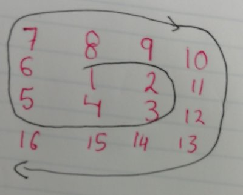

# Magic Spiral [javascript, rust]

For a given number: generate an array with numeric values, those values should be stored in an ascendant mode following an spiral figure. 


 
 Examples:

**n = 3**
| 7 | 8 | 9 |
|---|---|---|
| 6 | 1 | 2 |
| 5 | 4 | 3 |

**n = 2**
| 1 | 2 |
|---|---|
| 4 | 3 |


**n = 1**

|1|

**n = 4**

| 7 | 8 | 9 | 10|
|---|---|---|---|
| 6 | 1 | 2 |11 |
| 5 | 4 | 3 |12 |
| 16| 15| 14|13 |

## Usage

### Node [javascript]

```
node ./src/js/index.js [number]
```

Passing 2 as argument
```
node ./src/js/index.js 2
```

### Rust

Compiling the code
```
rust src/rust/rust.rs 
```

Passing 2 as argument
```
./src/rust/rust 2
```

Execute with bash/batch scripts:

```
// windows:
./src/rust/compile_run.bat 2

// Linux:
./src/rust/compile_run.sh 2
```

**Generated**
| 1 | 2 |
|---|---|
| 4 | 3 |


## Problem Solving 

Basically, the easy way to solve the prolem is to realize that a magic spiral contains only "L figures". Exists two kinds of "L" Figures: Upper and Lower.   

Every L figure is composed by a Column and a Row. The Only Difference between Upper L and Lower L, it's the order of the numeric values.

**Upper L figures**

 The numbers in the column are in descendant mode:
 ```
 [7]
 [6]
 [5]
```  
 The numbers in the row are in ascendant mode.
 ```
 [ 7][ 8][ 9]
```

 The final array looks like this:
 ```
  [ 7][ 8][ 9]
  [ 6][  ][  ]
  [ 5][  ][  ]
  ```

**Lower L figures**
Columns are generated in Ascending order, and are push to the end of the array.

```
 [10]
 [11]
 [12]
 [13]
```

Rows are generated in descending mode and ar push to the end of the array.

```
 [16][15][14][13]
```
   
 The final array looks like this:
```
 [  ][  ][  ][10] 
 [  ][  ][  ][11]
 [  ][  ][  ][12]
 [16][15][14][13]
```
 
### Merging ecach L figure of the Matrix

The problem is solved using an iterative approach. 

The spiral is divided in sub spirals. if n=3, then we have to generate spiral for 1, spiral for 2 and spiral for 3. And then merge the generated matrix. Every subspiral is named "L" Figure:


For every subspiral (L figure) we need to create a new array and merge it with the previous generated array. 

*Remember: exists two kinds of L Figures: UP and DOWN!*
 
Upside L:
Iterates over the size of matrix to be merged
Takes the base array, and add 1 to x and y axis in the base array to reallocate the merged array values. 
 
Downside L:
Iterates over the size of matrix to be merged. Takes the base array and maps exactly x and y with the array to be merged.
 
Example:


n=2

| 1 | 2 |
|---|---|
| 4 | 3 |


**Generate Column**
|   | 2 |
|---|---|
|   | 3 |

**Generate Row**
|   |   |
|---|---|
| 4 |   |

**Merge Columnd and Row and generate a new matrix**

|   | 2 |
|---|---|
| 4 | 3 |


**Merge previous Matrix**

Previous matrix:

| 1 |

Current Matrix (it's a downside matrix):
|   | 2 |
|---|---|
| 4 | 3 |


_previous matrix size: 1_

```
for (let ty = 0; ty < size - 1; ty++) {
    for (let tx = 0; tx < size - 1; tx++) {
        if (direction == "UP") {
            base[ty + 1][tx + 1] = arr[ty][tx];
        } else if (direction == "DOWN") {
            base[ty][tx] = arr[ty][tx];
        }
    }
}
```
Merged Matrix:

| 1 | 2 |
|---|---|
| 4 | 3 |

